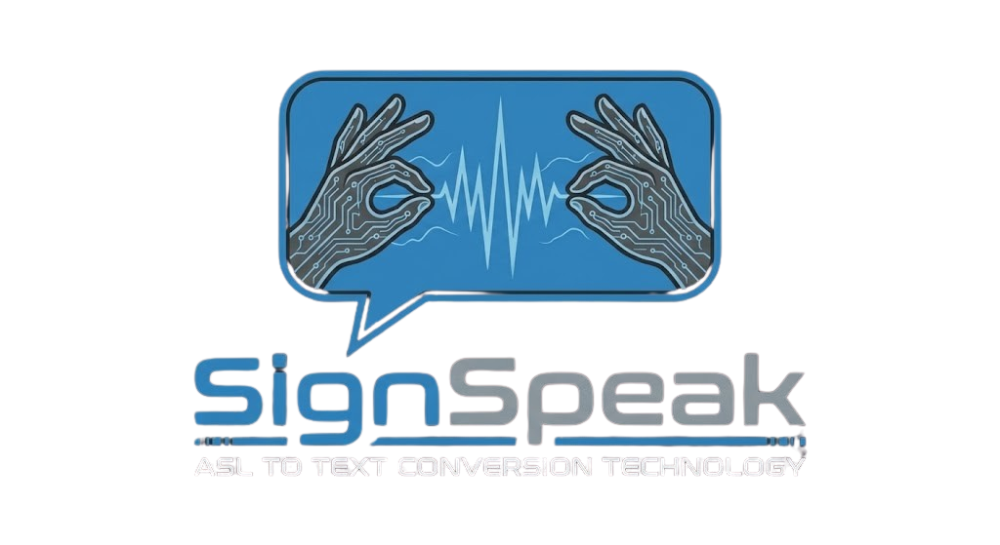
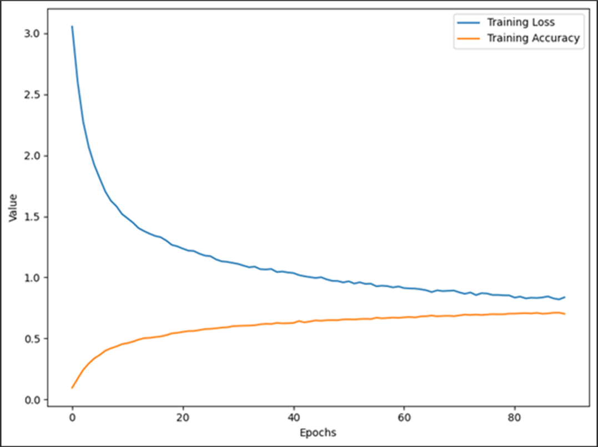

<div align="center">



<br><br>

[](https://python.org)
[](https://tensorflow.org)
[](https://mediapipe.dev)
[](https://opencv.org)
[](LICENSE)
[](/)

<br>

**Real-time American Sign Language recognition powered by deep learning**

[🚀 Quick Start](#-quick-start) • [✨ Features](#-features) • [🎮 Usage](#-usage) • [🧠 How It Works](#-how-it-works) • [🏋️ Training](#%EF%B8%8F-training)

---

</div>

## 🌟 Overview

**SignSpeak** is an AI-powered application that bridges the communication gap between the deaf/hard-of-hearing community and the hearing world. Using your webcam, it recognizes American Sign Language (ASL) alphabet gestures in real-time and converts them to text — with optional text-to-speech output.

<div align="center">

### 🎥 See It In Action

| Live Recognition | Hand Landmark Detection |
|:---:|:---:|
|  |  |
| *Instant letter prediction* | *21 keypoints tracked per hand* |

</div>

---

## ✨ Features

<table>
<tr>
<td align="center" width="25%">
<br>
<b>Real-Time</b><br>
<sub>Instant recognition at 30+ FPS</sub>
</td>
<td align="center" width="25%">
<br>
<b>Right Hand</b><br>
<sub>Optimized for right hand</sub>
</td>
<td align="center" width="25%">
<br>
<b>Voice Output</b><br>
<sub>Text-to-speech after 3s hold</sub>
</td>
<td align="center" width="25%">
<br>
<b>99.98% Accurate</b><br>
<sub>Trained on 48K+ samples</sub>
</td>
</tr>
</table>

### Additional Capabilities

- 📷 **Multi-Camera Support** — Switch between cameras with a single keypress
- 📝 **Data Logging Mode** — Record your own training data to improve the model
- 📊 **Confidence Threshold** — Only shows predictions above 70% confidence
- ⚡ **TFLite Optimized** — Lightweight model for fast inference
- 🎨 **Clean UI** — Beautiful overlay with real-time feedback

---

## 🔤 Supported Signs

<div align="center">

The model recognizes **24 ASL alphabet letters**:

```
╔═══╦═══╦═══╦═══╦═══╦═══╦═══╦═══╗
║ A ║ B ║ C ║ D ║ E ║ F ║ G ║ H ║
╠═══╬═══╬═══╬═══╬═══╬═══╬═══╬═══╣
║ I ║ K ║ L ║ M ║ N ║ O ║ P ║ Q ║
╠═══╬═══╬═══╬═══╬═══╬═══╬═══╬═══╣
║ R ║ S ║ T ║ U ║ V ║ W ║ X ║ Y ║
╚═══╩═══╩═══╩═══╩═══╩═══╩═══╩═══╝
```

> 💡 **Note:** Letters **J** and **Z** require motion gestures and are not currently supported.

</div>

---

## 🚀 Quick Start

### Prerequisites

| Requirement | Version |
|-------------|---------|
| 🐍 Python | 3.8+ |
| 📷 Webcam | Any USB/built-in |
| 💻 OS | macOS / Windows / Linux |

### Installation

```bash
# 1. Clone the repository
git clone https://github.com/Hamdan772/asl-translator.git
cd asl-translator

# 2. Create & activate virtual environment
python -m venv .venv
source .venv/bin/activate      # macOS/Linux
# .venv\Scripts\activate       # Windows

# 3. Install dependencies
pip install -r requirements.txt

# 4. Launch SignSpeak!
python app.py
```

---

## 🎮 Usage

### ⌨️ Keyboard Controls

<div align="center">

| Key | Mode | Action |
|:---:|:---:|---|
| <kbd>N</kbd> | Prediction | 🎯 **Recognition mode** — Detect and display signs |
| <kbd>K</kbd> | Logging | 📝 **Data collection** — Record training samples |
| <kbd>C</kbd> | Any | 📷 **Switch camera** — Cycle through devices |
| <kbd>0-9</kbd> | Logging | 🏷️ **Select class** — Choose letter to record |
| <kbd>ESC</kbd> | Any | 🚪 **Exit** — Close application |

</div>

### 🔊 Text-to-Speech

<div align="center">

```
┌────────────────────────────────────────────────┐
│  🤟 Hold any sign steady for 3 seconds...      │
│                                                │
│         ⏱️ 1s... 2s... 3s...                   │
│                                                │
│  🔊 "A" (spoken aloud!)                        │
└────────────────────────────────────────────────┘
```

</div>

> Works on **macOS** using the built-in `say` command. The letter won't repeat until you change signs.

### 🎛️ Configurable Settings

| Setting | Default | Description |
|---------|---------|-------------|
| **Confidence Threshold** | 70% | Predictions below this are filtered out |
| **TTS Hold Duration** | 3 sec | Time to hold sign before speaking |
| **Camera Device** | 0 | Default camera index |

---

## 🧠 How It Works

<div align="center">

```
┌──────────────┐    ┌──────────────┐    ┌──────────────┐    ┌──────────────┐
│   📷         │    │   ✋         │    │   🧠         │    │   📤         │
│   Camera     │───▶│   MediaPipe  │───▶│   TFLite     │───▶│   Output     │
│   Input      │    │   21 Points  │    │   Model      │    │   Letter     │
└──────────────┘    └──────────────┘    └──────────────┘    └──────────────┘
        │                  │                  │                    │
        ▼                  ▼                  ▼                    ▼
   Video Frame      Hand Landmarks      Classification      Text + Speech
    (BGR)           (x,y × 21)          (Softmax)          ("A", "B"...)
```

</div>

### Pipeline Breakdown

| Step | Component | Description |
|:---:|---|---|
| 1️⃣ | **Capture** | OpenCV grabs frames from webcam at ~30 FPS |
| 2️⃣ | **Detection** | MediaPipe identifies hand & extracts 21 3D landmarks |
| 3️⃣ | **Preprocessing** | Landmarks normalized relative to wrist, flattened to 42 features |
| 4️⃣ | **Inference** | TensorFlow Lite model classifies gesture in <10ms |
| 5️⃣ | **Filter** | Predictions below 70% confidence are filtered out |
| 6️⃣ | **Output** | Letter + confidence displayed on screen, optional TTS after 3s hold |

---

## 📁 Project Structure

```
signspeak/
│
├── 📄 app.py                      # 🚀 Entry point
├── 📄 train.py                    # 🏋️ Model training script
├── 📄 requirements.txt            # 📦 Dependencies
│
├── 📁 slr/                        # Core package
│   ├── 📄 main.py                 # Main application loop
│   │
│   ├── 📁 model/                  # ML models & data
│   │   ├── 🧠 slr_model.tflite    # Optimized inference model
│   │   ├── 🧠 slr_model.hdf5      # Keras training model
│   │   ├── 📊 keypoint.csv        # Training dataset (48K samples)
│   │   ├── 🏷️ label.csv           # Class labels (24 letters)
│   │   └── 📄 classifier.py       # TFLite wrapper
│   │
│   └── 📁 utils/                  # Utilities
│       ├── 📄 landmarks.py        # MediaPipe integration
│       ├── 📄 pre_process.py      # Data normalization
│       ├── 📄 draw_debug.py       # UI rendering
│       └── 📄 logging.py          # Data recording
│
├── 📁 docs/                       # Images & documentation
└── 📁 resources/                  # UI assets
```

---

## 🏋️ Training

<details>
<summary><b>📝 Step 1: Collect Training Data</b></summary>

<br>

1. Launch the app: `python app.py`
2. Press <kbd>K</kbd> to enter **Logging Mode**
3. Press a number key (0-9) to select the letter class
4. Perform the sign — data is recorded automatically
5. Samples save to `slr/model/keypoint.csv`

**Tips:**
- Record from different angles
- Vary lighting conditions
- Include both hands for robustness

</details>

<details>
<summary><b>🚀 Step 2: Train the Model</b></summary>

<br>

```bash
python train.py
```

**Training Features:**
- ✅ Automatic 80/20 train/validation split
- ✅ Class weight balancing for imbalanced data
- ✅ Early stopping (patience=50)
- ✅ Learning rate reduction on plateau
- ✅ Best model checkpointing

</details>

<details>
<summary><b>📊 Step 3: Model Performance</b></summary>

<br>

| Metric | Value |
|--------|-------|
| **Validation Accuracy** | 99.98% |
| **Validation Loss** | 0.0013 |
| **Training Samples** | ~48,000 |
| **Classes** | 24 |

**Output Files:**
- `slr/model/slr_model.hdf5` — Full Keras model
- `slr/model/slr_model.tflite` — Optimized for deployment

</details>

### 🏗️ Model Architecture

<div align="center">

```
         ┌─────────────────┐
         │   Input (42)    │  ← 21 landmarks × 2 coords
         └────────┬────────┘
                  ▼
         ┌─────────────────┐
         │  Dense (128)    │  ← 5,504 params
         │  BatchNorm      │
         │  Dropout (0.3)  │
         └────────┬────────┘
                  ▼
         ┌─────────────────┐
         │  Dense (64)     │  ← 8,256 params
         │  BatchNorm      │
         │  Dropout (0.3)  │
         └────────┬────────┘
                  ▼
         ┌─────────────────┐
         │  Dense (32)     │  ← 2,080 params
         │  BatchNorm      │
         └────────┬────────┘
                  ▼
         ┌─────────────────┐
         │  Dense (24)     │  ← Softmax output
         │  (Softmax)      │
         └─────────────────┘

     Total Parameters: ~17,500
```

</div>

---

## 🔧 Tech Stack

<div align="center">

| | Technology | Purpose |
|:---:|:---:|---|
|  | **Python 3.8+** | Core programming language |
|  | **TensorFlow 2.13** | Deep learning framework |
|  | **OpenCV 4.6** | Computer vision & camera |
| 🖐️ | **MediaPipe 0.10** | Hand landmark detection |
|  | **NumPy** | Numerical computing |
|  | **Pandas** | Data manipulation |

</div>

---

## 📋 Requirements

```txt
tensorflow==2.13.1
mediapipe==0.10.21
opencv-python==4.6.0.66
numpy==1.24.3
pandas==2.0.1
scikit-learn==1.2.2
matplotlib==3.7.1
seaborn==0.12.2
Pillow==9.5.0
```

---

## 🤝 Contributing

Contributions are welcome! Here's how you can help:

1. 🍴 Fork the repository
2. 🌿 Create a feature branch (`git checkout -b feature/amazing-feature`)
3. 💾 Commit your changes (`git commit -m 'Add amazing feature'`)
4. 📤 Push to the branch (`git push origin feature/amazing-feature`)
5. 🔃 Open a Pull Request

---

## 📄 License

This project is licensed under the **MIT License** — see the [LICENSE](LICENSE) file for details.

---

<div align="center">

## 💙 Acknowledgments

- **[MediaPipe](https://mediapipe.dev/)** by Google for hand tracking
- The **ASL community** for inspiration
- **[TensorFlow](https://tensorflow.org/)** for the ML framework

---


### ⭐ Star this repo if SignSpeak helped you!

**Made with ❤️ by [Hamdan](https://github.com/Hamdan772)**

*Bridging communication through technology*

<br>

[](https://github.com/Hamdan772)

</div>
